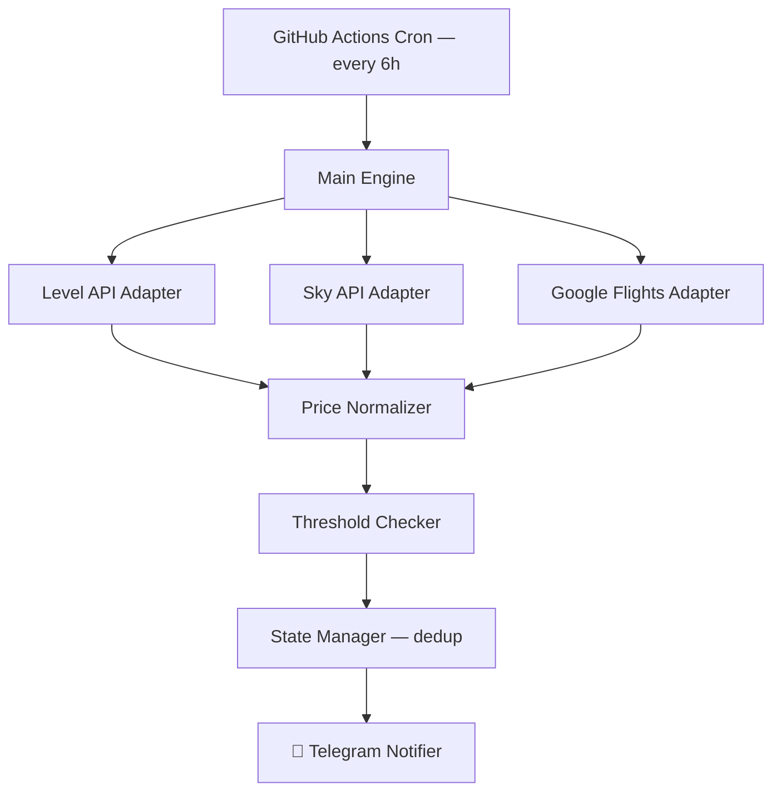

# ✈️ Flight Price Alert Bot


> Automated bot that monitors flight prices from multiple airline sources and sends Telegram alerts when prices drop below your configured thresholds. Runs every 6 hours on GitHub Actions — completely free.

---

## Por qué nació este proyecto

Vengo organizando viajes y el proceso de buscar vuelos baratos se había vuelto agotador: mil pestañas abiertas, buscadores lentos, sitios mal optimizados, y dedicándole horas todos los días sin garantía de encontrar el mejor precio.

Vi en Twitter la idea de un bot que avisara cuando los vuelos bajaran de cierto precio y pensé: "esto lo puedo hacer".

Empecé investigando las APIs de distintas aerolíneas usando DevTools del navegador — básicamente ingeniería inversa para ver qué requests hacían las webs al buscar vuelos. La mayoría estaban protegidas con captchas, tokens JWT o sistemas anti-bot como Akamai. Solo encontré dos aerolíneas (Level y Sky) con APIs accesibles.

Para cubrir el resto de aerolíneas, encontré `fast-flights`, una librería de Python que hace scraping de Google Flights simulando un navegador headless y devuelve los resultados de forma estructurada — sin necesidad de API key ni autenticación.

Combiné ambos enfoques: APIs directas donde es posible, Google Flights como fallback universal.

## Qué aprendí

- **Ingeniería inversa de APIs** — usar DevTools para interceptar requests y entender cómo funcionan servicios sin documentación pública
- **Automatización con GitHub Actions** — configurar workflows que corren scripts automáticamente cada 6 horas, sin servidor propio ni costos
- **Python async** — usar `httpx` y `asyncio` para hacer múltiples requests en paralelo
- **Arquitectura de adaptadores** — diseñar código extensible donde agregar una nueva aerolínea es crear un solo archivo
- **Persistencia de estado** — evitar alertas duplicadas guardando historial entre ejecuciones

## Qué hace

El bot automatiza todo el proceso: consulta tres fuentes de datos cada 6 horas, compara precios contra tus umbrales configurados, y te envía una notificación por Telegram en el momento que un vuelo baja del precio objetivo — incluyendo detalles como aerolínea, escalas, asientos disponibles, y si es el día más barato del mes.

## Features

The bot monitors multiple routes simultaneously using three data sources: **Level Airlines API** (direct, no authentication required) for European routes, **Sky Airline API** (public API key) for regional South American routes, and **Google Flights** (via the `fast-flights` library) as a universal fallback covering all airlines worldwide.

Each route has configurable price thresholds in both USD and ARS, with automatic cross-currency comparison using a manually-set exchange rate. A smart deduplication system prevents you from receiving the same alert repeatedly — but if the price drops even further, you'll get a "price dropped more!" notification.

Everything runs on GitHub Actions' free tier with zero infrastructure cost.

## Architecture


```mermaid
graph TD
    A[ GitHub Actions Cron — every 6h] --> B[Main Engine]
    B --> C[Level API Adapter]
    B --> D[Sky API Adapter]
    B --> E[Google Flights Adapter]
    C --> F[Price Normalizer]
    D --> F
    E --> F
    F --> G[Threshold Checker]
    G --> H[State Manager — dedup]
    H --> I[📱 Telegram Notifier]
```

Each data source has its own **adapter** that handles the specific API format and returns standardized `PriceResult` objects. The **checker** compares prices against thresholds with cross-currency support. The **state manager** tracks previously sent alerts to avoid duplicates.

## API Investigation

One of the most interesting parts of this project was reverse-engineering airline APIs using browser DevTools. By intercepting network requests (Network tab → Fetch/XHR filter) while searching for flights on each airline's website, I was able to identify which APIs are accessible and which are protected.

| Airline | API Status | Protection | Verdict |
|---------|-----------|------------|---------|
| **Level** | ✅ Open API | None | GET request, no auth needed |
| **Sky Airline** | ✅ Public key | Azure APIM key (in frontend JS) | POST with public API key |
| **Gol** | ❌ Protected | JWT + Akamai Bot Manager | Not viable |
| **LATAM** | ❌ Protected | reCAPTCHA + JWT + Akamai | Not viable |
| **JetSmart** | ⚠️ Session-based | ASP.NET session cookies | Fragile, not implemented |
| **Aerolíneas Arg.** | ❌ Not found | API not visible in DevTools | Not viable |

For full technical details, see [docs/api-investigation.md](docs/api-investigation.md).

## Current Configuration

**Active routes (as of Feb 2026):**

| Origin | Destination | Threshold | Trip Type |
|--------|-------------|-----------|-----------|
| Buenos Aires (EZE) | Rio de Janeiro (GIG) | < USD 350 | Round-trip 7-10 days |
| Buenos Aires (EZE) | Maceio (MCZ) | < USD 400 | Round-trip 7-10 days |
| Buenos Aires (EZE) | Salvador de Bahia (SSA) | < USD 400 | Round-trip 7-10 days |
| Buenos Aires (EZE) | Natal (NAT) | < USD 400 | Round-trip 7-10 days |
| Buenos Aires (EZE) | Fortaleza (FOR) | < USD 400 | Round-trip 7-10 days |
| Buenos Aires (EZE) | Recife (REC) | < USD 400 | Round-trip 7-10 days |
| Rosario (ROS) | Rio de Janeiro (GIG) | < USD 350 | Round-trip 7-10 days |
| Rosario (ROS) | Maceio (MCZ) | < USD 400 | Round-trip 7-10 days |
| Rosario (ROS) | Salvador de Bahia (SSA) | < USD 400 | Round-trip 7-10 days |
| Rosario (ROS) | Natal (NAT) | < USD 400 | Round-trip 7-10 days |
| Rosario (ROS) | Fortaleza (FOR) | < USD 400 | Round-trip 7-10 days |
| Rosario (ROS) | Recife (REC) | < USD 400 | Round-trip 7-10 days |

**Search parameters:**
- Period: Next 2 months (March-April 2026)
- Source: Google Flights
- Frequency: Every 6 hours
- Alert cooldown: 48 hours (no duplicate alerts)

## Route Coverage

| Route | Level | Sky | Google Flights |
|-------|:-----:|:---:|:--------------:|
| EZE → BCN (Barcelona) | ✅ | — | ✅ |
| EZE → ORY (Paris) | ✅ | — | ✅ |
| EZE → REC (Recife) | — | — | ✅ |
| EZE → GIG (Rio de Janeiro) | — | — | ✅ |
| EZE → SSA (Salvador) | — | ✅ | ✅ |
| ROS → Brazil destinations | — | — | ✅ |

## Setup Your Own Instance

### Prerequisites
- Python 3.11+
- A Telegram account
- A GitHub account

### 1. Fork & Clone
```bash
git clone https://github.com/YOUR_USERNAME/flight-price-bot.git
cd flight-price-bot
python -m venv venv
source venv/bin/activate  # On Windows: .\venv\Scripts\Activate.ps1
pip install -r requirements.txt
```

### 2. Create Telegram Bot
1. Open Telegram and search for `@BotFather`
2. Send `/newbot`, choose a name and username
3. Copy the token BotFather gives you
4. Send any message to your new bot
5. Visit `https://api.telegram.org/bot<YOUR_TOKEN>/getUpdates` to get your chat ID

### 3. Configure
```bash
cp .env.example .env
# Edit .env with your Telegram token and chat ID
```

Edit `config/routes.json` to set your routes, thresholds, and exchange rate.

### 4. Test Locally
```bash
python -m src.main --dry-run
```

### 5. Deploy to GitHub Actions
1. Push to GitHub
2. Go to repo Settings → Secrets → Actions
3. Add `TELEGRAM_BOT_TOKEN` and `TELEGRAM_CHAT_ID`
4. The bot will run automatically every 6 hours

## Cost Analysis

| Component | Cost |
|-----------|------|
| GitHub Actions | $0 (free tier: 2,000 min/month for private, unlimited for public repos) |
| Level API | $0 (no auth, public API) |
| Sky API | $0 (public API key) |
| Google Flights | $0 (fast-flights library, open source) |
| Telegram Bot API | $0 (free) |
| **Total** | **$0/month** |

## Tech Stack

| Component | Technology |
|-----------|-----------|
| Language | Python 3.11 |
| HTTP Client | httpx (async) |
| Google Flights | fast-flights |
| Notifications | Telegram Bot API (direct HTTP) |
| Scheduling | GitHub Actions cron |
| Config | JSON |
| State | JSON + GitHub Actions cache |
| Linting | ruff |
| Testing | pytest |

## Future Improvements

- 📊 Price history tracking with trend graphs
- 🌐 Web dashboard for viewing prices
- 🤖 ML-based price prediction ("buy now" vs "wait")
- ✈️ More airline adapters (JetSmart, Flybondi)
- 📱 Telegram interactive commands (/check, /status, /routes)
- 💱 Automatic exchange rate fetching

## License

MIT — see [LICENSE](LICENSE) for details.
